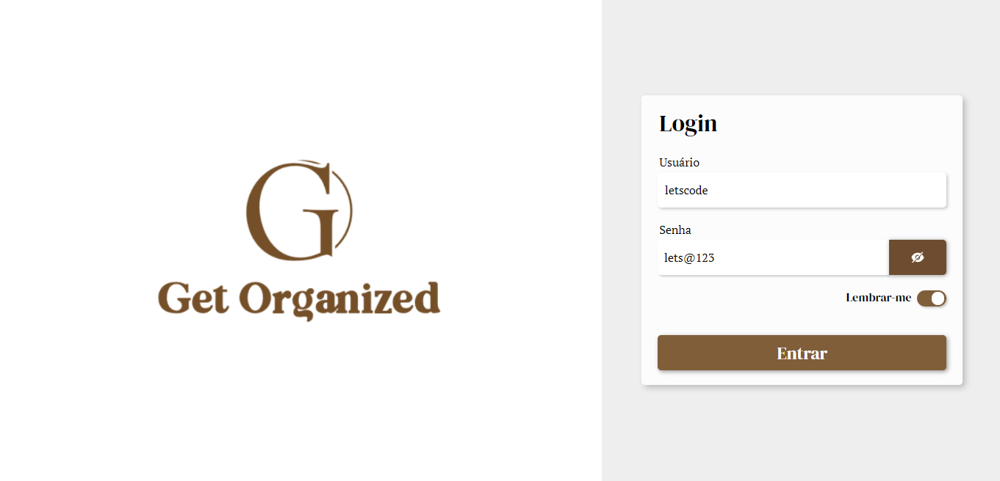
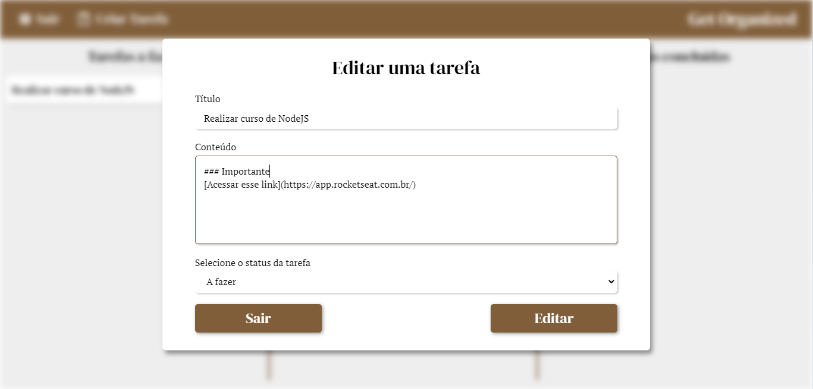
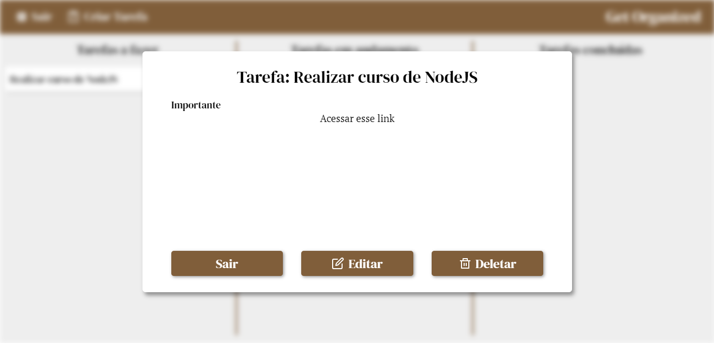

<h1 align="center">Get Organized</h1>

<p align="center">
 <a href="#Objetivo">Objetivo</a> •
 <a href="#Pré-requisitos">Pré-requisitos</a> • 
 <a href="#Imagens">Imagens</a> • 
 <a href="#Tecnologias">Tecnologias</a> • 
 <a href="#Autor">Autor</a>
</p>


### Objetivo

<p align="center">"Fazer a listagem de tarefas."</p>

  - O usuário pode:
    - Criar uma nova tarefa para ser feita.
    - Ver o título e conteúdo da tarefa em markdown.
    - Editar o título e o conteúdo da tarefa.
    - Editar qual estágio a tarefa se encontra: A fazer, fazendo ou Feito.
    - Deletar a tarefa.


### Pré-requisitos

Antes de começar, você vai precisar ter instalado em sua máquina as seguintes ferramentas:
[Git](https://git-scm.com), [Node](https://nodejs.org/en/), [Yarn](https://yarnpkg.com//).
Além disto é bom ter um editor para trabalhar com o código como [VSCode](https://code.visualstudio.com/).
No seu terminal Git, faça os seguintes comandos.

1. Clone este repositório.
```bash
git clone https://github.com/azevgabriel/get-organized
```

2. Acesse a pasta do projeto no terminal/cmd.
```bash 
cd get-organized
```

3. Acesse a pasta do back-end do projeto.
```bash
cd back
```

4. Instale as dependências do projeto.
```bash
yarn
```

5. Inicie o servidor local e não feche o terminal.
```bash
yarn dev
```

5. Em um novo terminal, acesse a pasta do front-end do projeto.
```bash
cd front
```

6. Instale as dependências do projeto.
```bash
yarn
```

5. Inicie o servidor local e não feche o terminal.
```bash
yarn start
```

6. Abrirá em seu navegador padrão esse site.


- Coloque as credenciais de acesso: 
    - Usuário: letscode 
    - Senha: lets@123

7. Usufrua da plataforma. :D

### Imagens

#### Editar Tarefa


#### Vizualizar Tarefa


### Tecnologias

As seguintes ferramentas foram usadas na construção do projeto:

- [React](https://pt-br.reactjs.org/)
- Typescript
- [Yarn](https://yarnpkg.com/)

### Autor

Foto   | Descrição
:---: | :---:
| <strong>Gabriel Azevedo</strong>, 1999 </br> Estudante de Engenharia de Computação </br>IFSULDEMINAS - Poços de Caldas</br></br>[](https://github.com/azevgabriel)[](https://www.linkedin.com/in/azevgabriel/)[](https://vercel.com/azevgabriel/)

